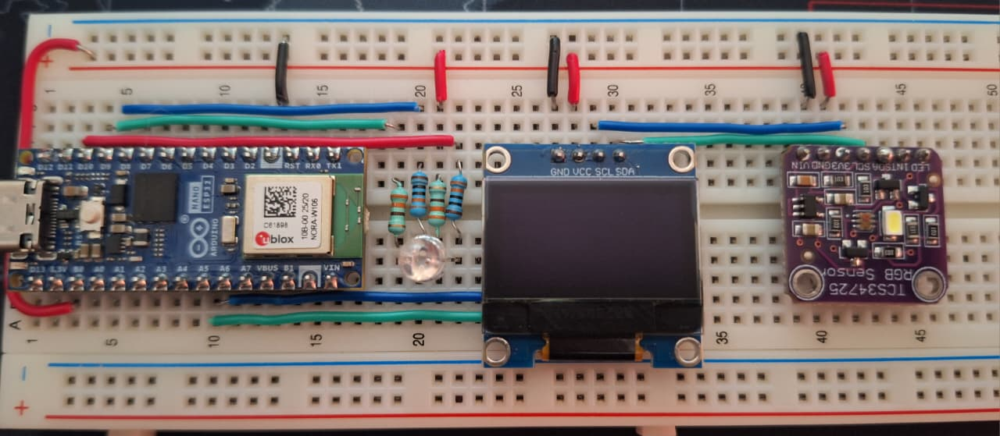
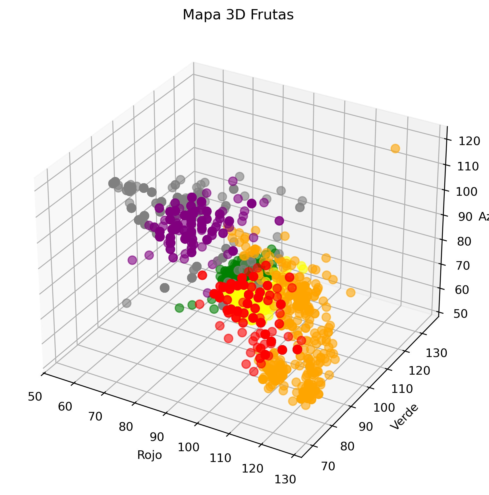
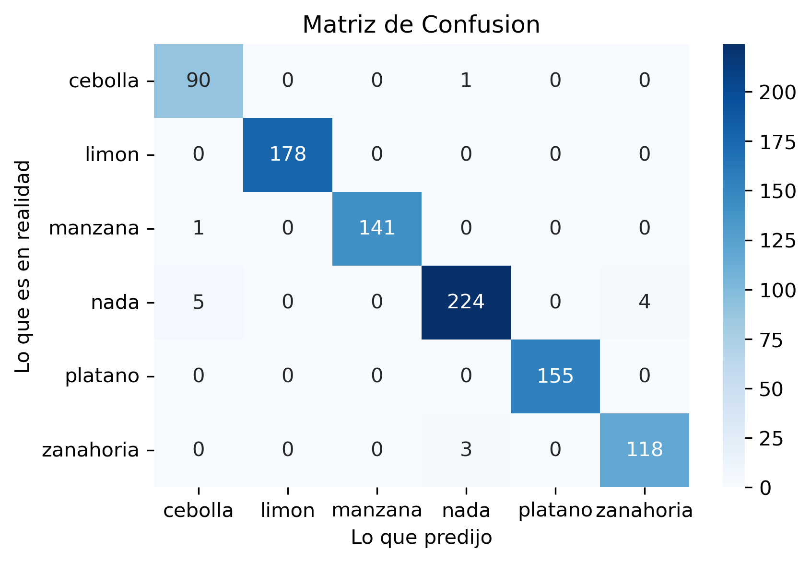
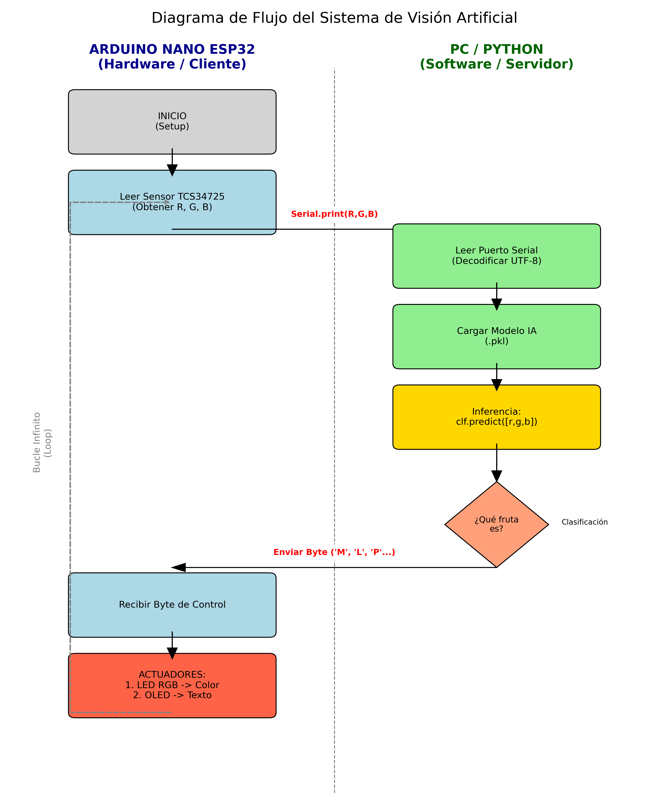
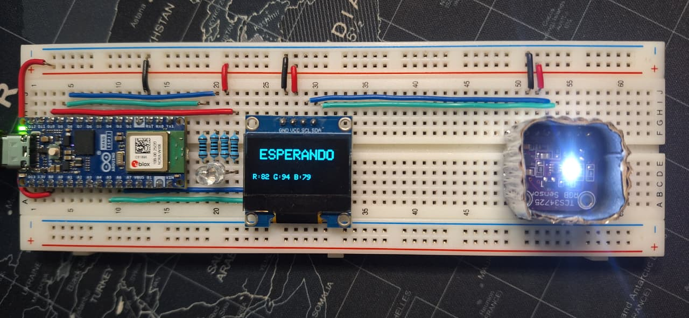
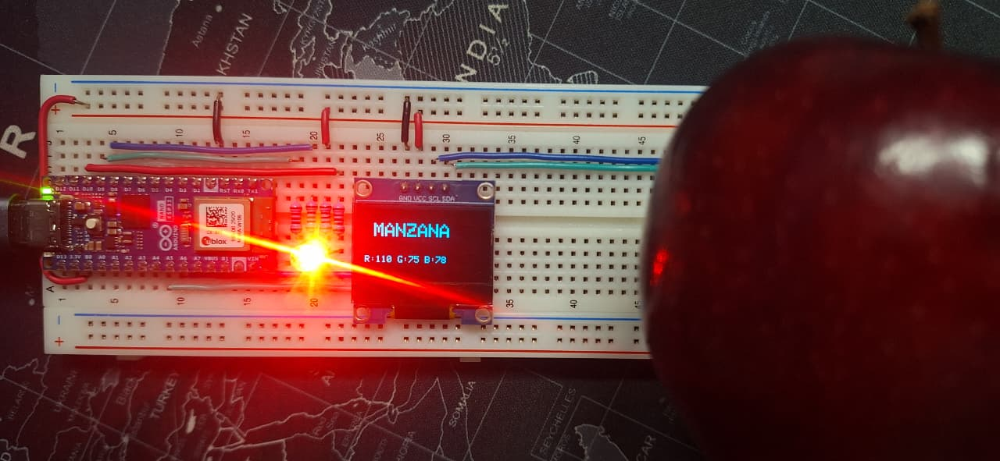
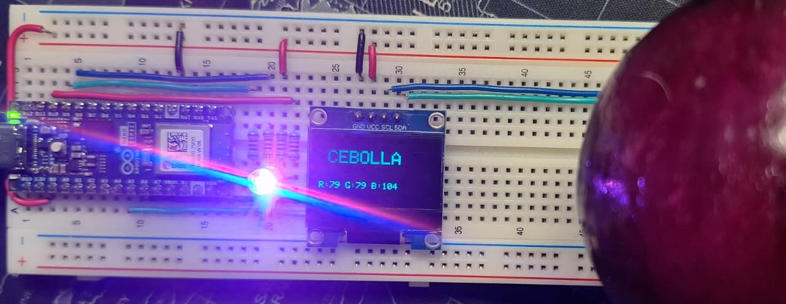
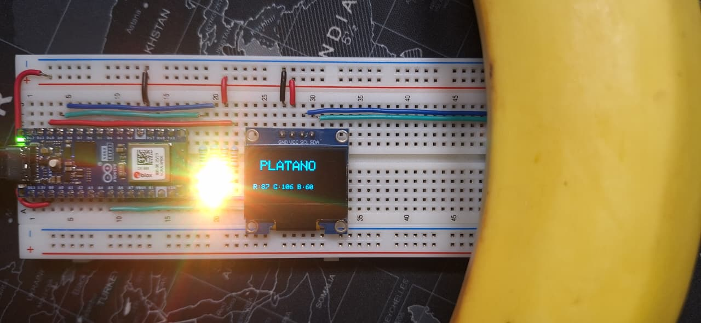
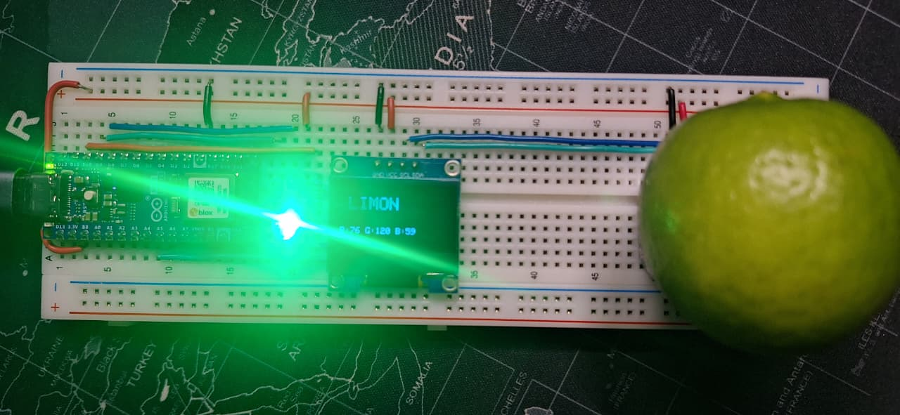
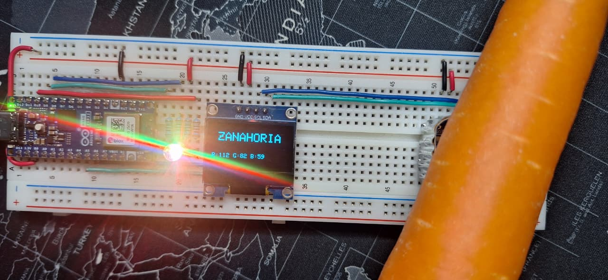

# RGBFruitClassifier_MLP_ESP32
Clasificador de frutas en tiempo real usando un sensor RGB (TCS34725), Arduino Nano ESP32 y una Red Neuronal Multicapa (MLP) en Python. | Real-time fruit classifier using an RGB sensor (TCS34725), Arduino Nano ESP32, and a Multilayer Perceptron (MLP) Neural Network in Python.

# Clasificador de Frutas y Verduras con Redes Neuronales y Sensor RGB

Este proyecto implementa un sistema de clasificación automática de objetos a partir de su lectura espectral del color capturado en el espacio RGB. La solución integra un pipeline completo de hardware y software capaz de adquirir, procesar y clasificar datos en tiempo real mediante un modelo de Red Neuronal Perceptrón Multicapa (MLP).

---

## Arquitectura de Hardware e Instrumentación

El subsistema de adquisición y actuación física fue diseñado bajo una arquitectura de sistema embebido, priorizando la fidelidad en la obtención de datos físicos para su posterior procesamiento analítico.

### Componentes del Sistema
* **Microcontrolador:** Arduino Nano ESP32 (Modelo ABX00083). Seleccionado por su capacidad de procesamiento superior y arquitectura nativa de 3.3V, ideal para manejar comunicación serial de alta velocidad (115200 baudios) sin latencia en la transmisión de datos.
* **Sensor Óptico de Color:** TCS34725.Dispositivo I2C provisto de un filtro de bloqueo IR incorporado, esencial para minimizar la interferencia de la luz ambiental no visible durante la captura de muestras.
* **Interfaz de Monitoreo:** Display OLED SSD1306 (128x64 píxeles). Proporciona telemetría y retroalimentación del estado de inferencia en tiempo real de forma autónoma.
* **Actuador Visual:** LED RGB de Ánodo Común.
* **Electrónica Base:** Protoboard de 830 puntos, cableado estandarizado calibre 22 y cuatro resistencias limitadoras de corriente de 100Ω.

### Ensamblaje Físico



El circuito fue estructurado para mantener una distribución óptima de las conexiones I2C y señales PWM. Adicionalmente, el transductor óptico fue aislado mediante una barrera física opaca para limitar la incidencia de luz ambiental aleatoria, asegurando condiciones de medición controladas y estables.

## Pipeline de Machine Learning

El desarrollo del modelo predictivo se estructuró en tres fases secuenciales: Adquisición de datos, Análisis Exploratorio (EDA) y Entrenamiento de la Red Neuronal.

### 1. Construcción del Dataset
Para garantizar la calidad de los datos, se desarrolló un script en Python (`capturaDatos.py`) que automatiza la recolección de muestras vía comunicación serial. Se capturaron conjuntos de 100 lecturas continuas por cada clase, generando archivos CSV independientes. 

Un aspecto crítico del diseño fue la inclusión de la clase de control `Nada` (captura del ruido ambiental sin objeto). Esto dota al modelo de la capacidad de abstenerse y evitar falsos positivos en el entorno de despliegue.

### 2. Análisis Exploratorio de Datos (EDA)
Previó al entrenamiento, se realizó un análisis topológico del espacio de características. Al mapear las clases en un espacio tridimensional (R-G-B), se confirmó la no-linealidad del problema. Clases como la Zanahoria (Naranja) y el Plátano (Amarillo) presentaron proximidad espacial con fronteras de decisión difusas, justificando la necesidad de un algoritmo multicapa sobre clasificadores lineales convencionales.



### 3. Diseño y Entrenamiento del Perceptrón Multicapa (MLP)
El núcleo del clasificador fue implementado utilizando la biblioteca `scikit-learn` en un entorno de Jupyter Notebook (`entrenamientoFrutas.ipynb`). 

**Arquitectura y Optimización:**
* **Topología:** 3 Neuronas de entrada (R, G, B), dos capas ocultas de 20 neuronas cada una, y 6 neuronas de salida (Clases).
* **Función de Activación:** Se seleccionó la Tangente Hiperbólica (`Tanh`) tras validar empíricamente que su naturaleza de curva suave modelaba con mayor precisión las transiciones de color entre frutas frente a funciones como `ReLU`.
* **Desempeño:** El modelo alcanzó una precisión superior al 94% en el conjunto de validación.

La siguiente matriz de confusión ilustra el rendimiento del algoritmo, demostrando una alta tasa de verdaderos positivos y aislando eficazmente las clases conflictivas.



## Despliegue y Ejecución del Sistema

El sistema opera bajo una arquitectura de integración Cliente-Servidor distribuida. El microcontrolador asume el rol de cliente, encargándose de la transducción óptica y la actuación física, mientras que el entorno Python opera como servidor, ejecutando el modelo de inferencia computacionalmente intensivo.



### Prerrequisitos Técnicos
* **Hardware:** Circuito ensamblado y calibrado.
* **Entorno de Desarrollo:** Python 3.10+ y Arduino IDE 2.x.
* **Dependencias Python:** `scikit-learn`, `pyserial`, `pandas`, `joblib`, `matplotlib`, `seaborn`.
* **Bibliotecas Arduino:** `Adafruit_TCS34725`, `Adafruit_SSD1306`, `Adafruit_GFX`.

### Guía de Operación

#### Fase 1: Adquisición de Datos (Opcional para Reentrenamiento)
1. Compilar y cargar el firmware `lecturasSensor/lecturasSensor.ino` en la placa Arduino Nano ESP32.
2. Ejecutar el script `capturaDatos.py` en el entorno Python para inicializar la captura de muestras espectrales y generar los archivos `.csv` correspondientes.
3. Ejecutar secuencialmente las celdas del documento `entrenamientoFrutas.ipynb` para procesar el nuevo conjunto de datos y sintetizar el archivo binario del modelo neuronal (`.pkl`).

#### Fase 2: Inferencia en Tiempo Real
1. **Inicialización del Hardware:** Cargar el firmware `arduinoCalculoFinal/arduinoCalculoFinal.ino` en el microcontrolador. Tras el arranque, la pantalla OLED indicará el estado lógico "ESPERANDO".
2. **Arranque del Servidor Lógico:** Validar la existencia del modelo serializado (`modeloFrutasTanh.pkl`) en el directorio raíz. Desde la terminal de comandos, ejecutar el script principal:
   ```bash
   python calculoFinalFrutas.py
3. **Clasificación Continua:** El script cargará los pesos de la red neuronal, establecerá la conexión serial a 115200 baudios y comenzará a clasificar. Al colocar una muestra frente al sensor, el Arduino actualizará instantáneamente la pantalla OLED y el LED RGB con el color correspondiente.

---

#### CIRCUITO ESPERANDO


#### MANZANA


#### CEBOLLA MORADA


#### PLATANO


#### LIMON


#### ZANAHORIA

